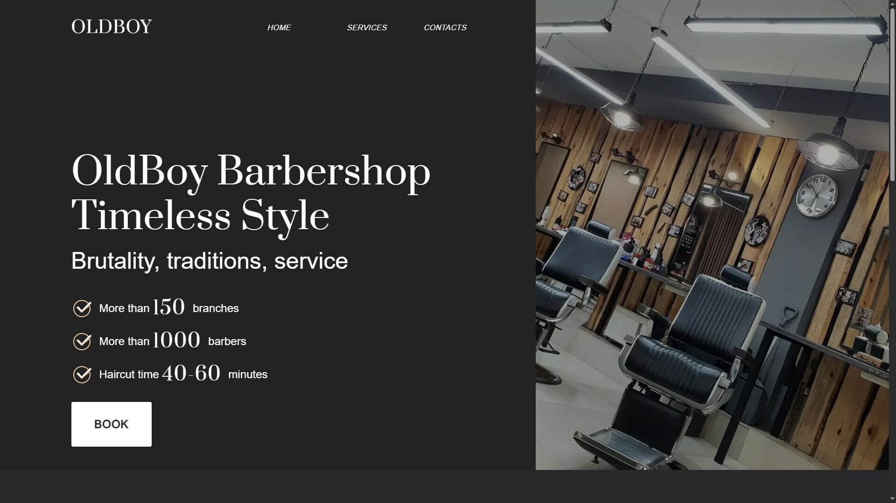

# Проект "OldBoy Barbershop" — Сайт сети мужских парикмахерских

## О проекте

Данный проект представляет собой одностраничный сайт сети барбершопов **OldBoy**, оформленный в брутальном, мужском стиле. Он включает в себя основные разделы: вступление, информацию о преимуществах, форму записи, а также футер с контактами и ссылками на соцсети.

Сайт выполнен с использованием адаптивной и семантической верстки, а также учитывает требования к доступности. Он демонстрирует фирменный стиль и философию бренда — мужественность, профессионализм, качество и атмосферу клубного сообщества.

## Превью проекта



## Ссылка на демо

- [Посмотреть проект в живую](https://old-boy-project.vercel.app/)

## Статус проекта

Проект завершен.

## Функциональность

- **Навигация по разделам**: Удобное меню с якорными ссылками.
- **Кликабельные кнопки "Записаться"**: В нескольких местах страницы реализованы кнопки для перехода к форме записи.
- **Форма записи**: Включает ввод имени и email, а также чекбокс согласия с политикой конфиденциальности.
- **Адаптивная верстка**: Сайт корректно отображается на различных устройствах.
- **Использование графики**: Поддержка изображений в формате `.webp` и `.jpg` для оптимизации производительности.

## Технологии и инструменты

- **HTML5** — Семантическая и структурированная разметка.
- **CSS3** — Стилизация компонентов сайта.
- **Методология БЭМ** — Подход к именованию классов для лучшей масштабируемости и читаемости.
- **Flexbox** — Для построения гибкой и адаптивной сетки.
- **Модульная структура** — Отдельные CSS и JS-файлы по страницам.
- **SVG спрайты** — Использование иконок через `<use>` и общий SVG-спрайт.
- **Формат изображений WebP** — Для ускорения загрузки и оптимизации ресурсов.

## Как запустить проект локально

1. Склонируйте репозиторий:

   ```bash
   git clone https://github.com/kirill-io/OldBoy-project.git
   ```
2. Перейдите в директорию проекта:
 
    ```bash 
    cd oldboy-barbershop
    ```
 
3. Откройте файл index.html в браузере или используйте расширение Live Server в редакторе кода (например, VS Code).
